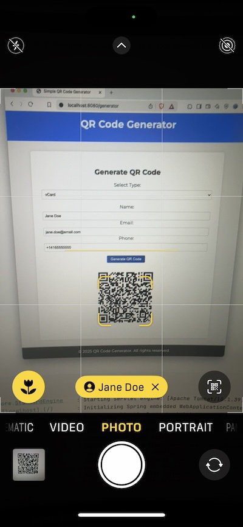

# QR Code Generator

This project implements a simple QR code generator.

## Features

- QR code for website links
- QR code for direct link to call a phone number
- QR code for direct link to send a text message (SMS)
- QR code for direct link to send an email
- QR code for direct link to connect to WiFi
- QR code for vCard (simple)
- QR code for any generic text

## Getting Started

### Prerequisites

- Java 21 or higher

### Building the Project

1. Clone the repository, e.g.
   ```shell
   git clone https://github.com/nevenc/qr-code-generator.git
   ```

2. Build the project using Maven, e.g.
   ```shell
   cd qr-code-generator
   ./mvnw clean package
   ```

3. Run the application, e.g.
   ```shell
   ./mvnw spring-boot:run
   ```

### Deploying to Tanzu Platform or Cloud Foundry

1. Build the application, e.g.
   ```shell
   ./mvnw clean package
   ```

2. Push the application, e.g.
   ```shell
   cf push
   ```
3. Test the application, e.g.
   ```shell
   open https://qr.apps.cf.tanzu.dev
   ```
   
## Usage

1. Start the application and navigate to `http://localhost:8080` in your web browser.


2. Select a type of QR code you would like to generate, e.g. vCard

3. Fill in the details.

4. Click "Generate QR Code"


5. Point your phone camera to the generated QR code to test.



## Background

There are a number of useful QR Code direct links, such sa websites, vCARD, Wifi Connection Details,
direct phone links, direct SMS links, direct email links, etc.

Often times, I find myself creating QR codes for my demos and presentations using different websites.
I wanted to have a private QR code generator I control and run myself.

I am using [Nayuki's](https://nayuki.io) [QR Code generator](https://github.com/nayuki/QR-Code-generator)
library to generate QR codes.

## License

This project is licensed under the Apache License, Version 2.0. See the LICENSE file for details.

## Thanks

Thanks [Nayuki](https://nayuki.io) for building a great [QR Code Generator](https://github.com/nayuki/QR-Code-generator) library,
and sharing it with the rest of the world.

Thanks [Alexandre Roman](https://x.com/alexandre_roman) for an inspiration and for creating [html-assistant](https://github.com/alexandreroman/html-assistant),
a great tool for helping build HTML pages using GenAI (with [Spring AI](https://spring.io/projects/spring-ai)).
